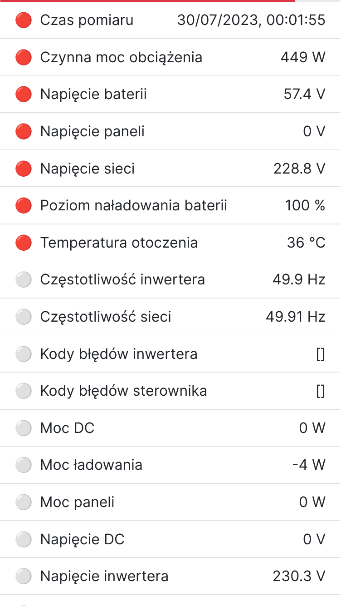
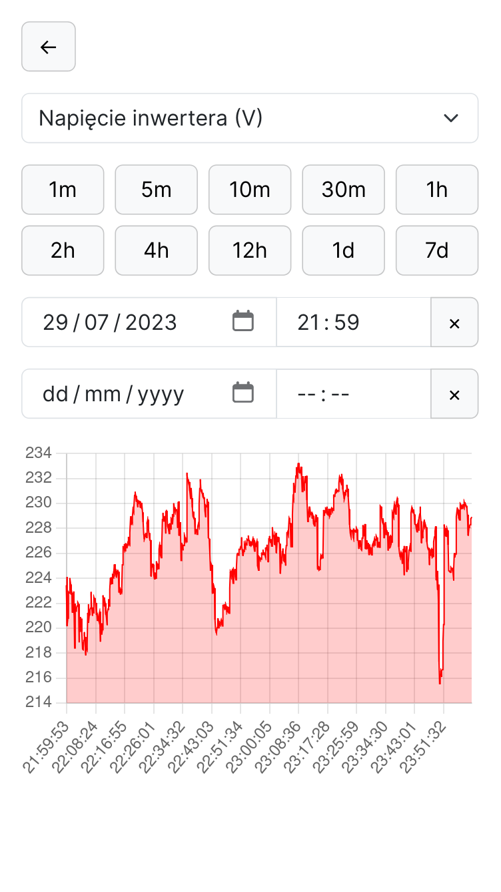

# Solar

The datalogger for solar inverter, based on reverse engineering result.

This is an EXPERIMENTAL SOFTWARE. Do not ask for technical support. See
[license](LICENSE.md).

|  |  |
| :------------------: | :------------------: |
|    Parameter list    |   Parameter charts   |

## Features

- Read inverter parameters using Modbus serial protocol
- Save current inverter state to the database
- Send current inverter state to built-in MQTT broker
- Display current inverter state, pin parameters to the top
- Display charts for each inverter parameter
- Change parameters based on current state (experimental)

This software is tested with Raspberry Pi 3A and Debian 12 in UEFI mode:

<details>
<summary>Details</summary>

```
$ hostnamectl
 Static hostname: solar
       Icon name: computer-embedded
         Chassis: embedded
      Machine ID: (redacted)
         Boot ID: (redacted)
Operating System: Debian GNU/Linux 12 (bookworm)
          Kernel: Linux 6.1.0-10-arm64
    Architecture: arm64
 Hardware Vendor: Raspberry Pi Foundation
  Hardware Model: Raspberry Pi 3 Model A+
Firmware Version: UEFI Firmware v1.39

$ free
               total        used        free      shared  buff/cache   available
Mem:          412376      237984       12776       15372      186792      174392
Swap:        1048572       38912     1009660
```

</details>

## Used technologies

- Python, Django + REST framework
- JavaScript, Vite, React, Bootstrap, Chart.js, Day.js
- PostgreSQL
- Mosquitto MQTT broker
- NGINX serving static files
- Docker, Compose
